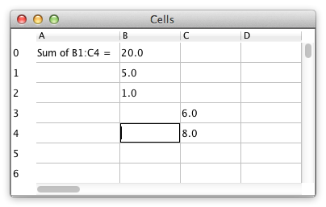

# Cells

**Challenges**: change propagation, widget customization, implementing 
a more authentic/involved GUI application.

The task is to create a simple but usable spreadsheet application. The 
spreadsheet should be scrollable. The rows should be numbered from 0 to 
99 and the columns from A to Z. Double-clicking a cell C lets the user 
change C’s formula. After having finished editing the formula is parsed and 
evaluated and its updated value is shown in C. In addition, all cells which 
depend on C must be reevaluated. This process repeats until there are no 
more changes in the values of any cell (change propagation). Note that one 
should not just recompute the value of every cell but only of those cells 
that depend on another cell’s changed value. If there is an already provided
spreadsheet widget it should not be used. Instead, another similar widget
 (like JTable in Swing) should be customized to become a reusable 
 spreadsheet widget.

Cells is a more authentic and involved task that tests if a particular 
approach also scales to a somewhat bigger application. The two primary 
GUI-related challenges are intelligent propagation of changes and widget 
customization. Admittedly, there is a substantial part that is not necessarily 
very GUI-related but that is just the nature of a more authentic challenge. 
A good solution’s change propagation will not involve much effort and the
 customization of a widget should not prove too difficult. The 
 domain-specific code is clearly separated from the GUI-specific code. 
 The resulting spreadsheet widget is reusable.

Cells is directly inspired by the SCells spreadsheet example from the book 
Programming in Scala. Please refer to the book (or the implementations in 
this repository) for more details especially with respect to the not directly 
GUI-related concerns like parsing and evaluating formulas and the precise 
syntax and semantics of the spreadsheet language.

[Try it out](src/Cells.elm)

